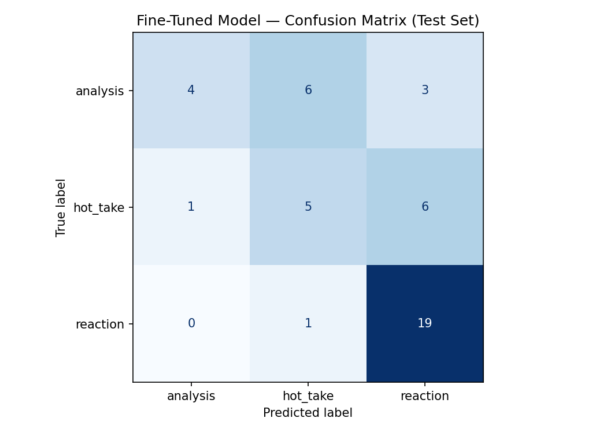

# 🏀 TakeMeter: r/nba Discourse Quality Classifier

A fine tuned text classifier that rates the quality of a take in r/nba discussion. Given a
comment, it predicts whether the comment is **`analysis`** (an evidence backed argument),
**`hot_take`** (a confident opinion with no real support), or **`reaction`** (an in the moment
emotional response).

*AI201 Project 3. Design notes live in [`planning.md`](planning.md); this README is the final
report.*

> **Status:** fine tuning and the zero shot baseline are done and the evaluation report is
> written. **Headline finding: the zero shot Groq baseline (0.844 accuracy) beat the fine tuned
> DistilBERT (0.622).** Remaining `⏳` items are §6.5 sample classifications and the local
> calibration table (both need the downloaded `takemeter-model/`), §8 spec reflection, §11 AI
> usage, and §12 demo.

***

## 1. Community choice and reasoning

I chose **r/nba**. "What makes a good take" is *native* community vocabulary there. Users
routinely call each other out for "hot takes," praise "actual analysis," and dismiss "just
reaction." A single game thread mixes one word emotional bursts, confident unsupported
opinions, and genuinely reasoned breakdowns, often about the *same* topic. That topic overlap
is what makes the task nontrivial: the classifier can't key off subject matter, it has to
learn *how a claim is supported*. See [`planning.md §1`](planning.md).

## 2. Label taxonomy

The decision axis is **how the claim is supported**, not the topic or whether the claim is
correct. Labels are mutually exclusive.

| Label | Definition | Example 1 | Example 2 |
|---|---|---|---|
| **analysis** | Structured argument backed by specific, verifiable evidence (stats, historical comparison, tactical observation). Strip the opinion framing and a real argument remains. | *"Their half court D rating is 3rd since the break. The regression is entirely in transition (12th, 27th). That's effort, not scheme."* | *"Wemby's already a better rim protector than rookie KAT (3.6 vs 1.7 BPG) on similar 3pt volume. That's the whole case for him being a different tier."* |
| **hot_take** | A bold, confident opinion asserted without genuine evidence. Decorative, cherry picked stats that only sound credible still count. | *"Jokic is the most skilled big to ever touch a basketball and it's not close. Anyone who disagrees doesn't watch basketball."* | *"The Lakers are making the Finals this year, book it."* |
| **reaction** | Immediate emotional response to a play/game/event. Little to no argument. | *"NOOOO not again every single year man I can't do this 😭"* | *"BANG. game over. I'm levitating right now."* |

## 3. Dataset

* **Source:** public r/nba comments collected with [`collect.py`](collect.py) (PRAW, with a
  no auth `.json` fallback), sampled across a **mix of thread types** (game and post game threads
  that are reaction rich, r/nbadiscussion serious threads that are analysis rich, and opinion bait posts
  that are hot_take rich) so labels don't correlate with thread type. Public content only.
* **Labeling process:** each comment read and labeled by hand against the
  [`planning.md §2`](planning.md) definitions. *(Optionally prelabeled by Groq via
  [`prelabel.py`](prelabel.py) and then reviewed and corrected row by row: see §11 AI usage.)*
* **File:** [`data/labeled_data.csv`](data/labeled_data.csv) (`text, label, notes`), a single
  file; the notebook does the 70/15/15 split.

### Label distribution
| Label | Count | % |
|---|---|---|
| analysis | 83 | 28.2% |
| hot_take | 82 | 27.9% |
| reaction | 129 | 43.9% |
| **Total** | **294** | 100% |

Every class clears the 20% floor and sits well under the 70% ceiling. reaction is the largest,
which is expected for r/nba (game thread emotion is the most common register), but not dominant.
The set is 300 collected comments minus 6 automoderator and mod removal messages that were
dropped as non discourse.

### Three genuinely difficult examples

1. **Long but evidence free rant (id `osyvx7q`).** *"I've watched Giannis play for years and I
   don't have memory rot... 2 weeks of good play is nothing... people always remember the
   highlights but not the games he handed to us by bricking jump shot after jump shot."* The
   length and paragraph structure pattern match to `analysis`, but the comment offers only
   assertion and memory, no verifiable evidence. Labeled `hot_take` on the rule *length is not
   evidence*.
2. **One load bearing stat (id `oswc8z5`).** *"Castle is 21 and was 6th in assists lol."* Very
   short and casual, but the single stat (6th in assists) is doing the real argumentative work
   in a debate about whether Castle is a passer, not decorating an opinion. Labeled `analysis`.
   Another commenter (id `oswadsy`) replied to correct it to "9th in the league," which confirms
   the stat was a genuine, checkable claim rather than a flourish.
3. **Emotional venting that contains a take (id `osytrru`).** *"Ah now he's trying to compensate
   and rewrite the narrative around his ring... Dude just stop.....you went to a super team to
   get a ring. Stop the bullshit."* It embeds an opinion (joined a super team for a ring) inside
   what is dominantly emotional venting at a person. Labeled by *dominant function*: the register
   is emotional and in the moment, so `reaction`, even though a take is buried in it.

## 4. Fine tuning approach

* **Base model:** `distilbert-base-uncased` (HuggingFace), a small, fast encoder well suited
  to a 3 class sequence classification task on a few hundred examples.
* **Setup:** course Colab notebook, free **T4 GPU**, `transformers` `Trainer`. 70/15/15
  stratified split (206 train, 44 validation, 45 test). `TrainingArguments`: 3 epochs, learning
  rate 2e-5, train batch 16 (eval batch 32), weight decay 0.01, 50 warmup steps,
  `load_best_model_at_end=True` on validation accuracy with `save_total_limit=1`.
* **Key hyperparameter decision and what the training log revealed:** I kept the notebook defaults
  (3 epochs, lr 2e-5, batch 16). Because of `load_best_model_at_end`, the saved model is the
  **epoch 2** checkpoint (best validation accuracy 0.61; epoch 3 fell to 0.55 on the noisy 44
  example validation set). The more important signal is that **the model underfit**: training and
  validation loss fell monotonically but only from about 1.10 to 1.02 across the three epochs, and
  1.10 is essentially the random loss for three classes (ln 3 is about 1.10). The loss was still
  descending at epoch 3, so 3 epochs was too few here. The usual concern with a few hundred
  examples is overfitting; the opposite happened. The model barely moved off the uniform prior,
  which is consistent with its low confidence errors (§6.4) and its habit of defaulting to the
  easy `reaction` class. The honest decision: leave it at 3 epochs and report the undertrained
  result rather than tuning to chase a number. More epochs or a higher learning rate would likely
  raise the fine tuned score, though probably not past the 0.844 zero shot baseline.

## 5. Baseline (zero shot Groq)

* **Model:** `llama-3.3-70b-versatile`, temperature 0, classifying each **test** comment with
  no task specific training.
* **Prompt:** the exact prompt in [`baseline_prompt.md`](baseline_prompt.md): the label
  definitions verbatim from planning.md, one illustrative example per label (taken from the
  planning §2 taxonomy, **not** from the test set, so the baseline sees no test data), and
  "output only the label name." Passed as a system message with the comment as a separate user
  message.
* **How results were collected:** run in the notebook's Section 5 over the locked test split.
  All 45 of 45 responses parsed cleanly (0% unparseable), so no prompt tightening was needed.

***

## 6. Evaluation report

### 6.1 Headline metrics
*Test set n = 45 (15% of 294).*

| Metric | Zero shot baseline | Fine tuned DistilBERT |
|---|---|---|
| Overall accuracy | **0.844** | 0.622 |
| Macro F1 | **0.84** | 0.55 |

**Headline finding: the zero shot 70B baseline beat the fine tuned model by 22 accuracy points
(0.29 macro F1).** Fine tuning regressed. This is the most important result in the report and §7
explains why: a large general model handles the subjective "is the evidence load bearing"
judgment that DistilBERT cannot learn from roughly 206 training examples. This is not a bug or
leakage (leakage would inflate the fine tuned score; the classes are balanced; the drop is
consistent with the fine tuned model's failure on the analysis and hot_take classes below).

### 6.2 Per class metrics
| Label | Model | Precision | Recall | F1 | Support |
|---|---|---|---|---|---|
| analysis | baseline | 0.85 | 0.85 | 0.85 | 13 |
| analysis | fine tuned | 0.80 | 0.31 | 0.44 | 13 |
| hot_take | baseline | 0.73 | 0.92 | 0.81 | 12 |
| hot_take | fine tuned | 0.42 | 0.42 | 0.42 | 12 |
| reaction | baseline | 0.94 | 0.80 | 0.86 | 20 |
| reaction | fine tuned | 0.68 | 0.95 | 0.79 | 20 |

The per class view is where the regression becomes legible. The baseline is strong and even
across all three classes (F1 0.85 / 0.81 / 0.86). The fine tuned model is only competitive on
`reaction` (0.79 vs 0.86) and collapses on the two subjective classes: `analysis` F1 0.44 (it
recalls only 31% of true analysis) and `hot_take` F1 0.42. The boundary the baseline handles
cleanly is exactly the one fine tuning failed to learn.

### 6.3 Confusion matrix (fine tuned, test set)
*Rows = true label, columns = predicted. The markdown table below is the primary version; the
committed image is the same data as a figure.*



| true \ pred | analysis | hot_take | reaction |
|---|---|---|---|
| **analysis** | 4 | 6 | 3 |
| **hot_take** | 1 | 5 | 6 |
| **reaction** | 0 | 1 | 19 |

*Reading: the diagonal (4, 5, 19) is correct. The two heavy off diagonal cells are
analysis to hot_take (6) and hot_take to reaction (6), the two subjective boundaries. reaction
is almost never missed (19 of 20).*

### 6.4 Three wrong predictions, analyzed

Context: all 17 of the fine tuned model's test errors came with confidence between 0.34 and
0.37, barely above the 0.33 random floor. The model is not confidently wrong, it is uncertain,
and that uncertainty falls on exactly the two subjective boundaries. The three below are chosen
to cover each confusion direction (analysis to hot_take, hot_take to reaction, analysis to
reaction).

1. **Comment (id `ost0weg`):** *"I didnt read the article but... 11.6k in expenses (140k a
   year) 7k baby mama fees... even if you cut 60% of his nba earnings for taxes and agent fees
   thats 70 million left over... If he just saved 40 million... thats 400k for 100 years after
   taxes... His current lifestyle is more than manageable."* **true** `analysis` / **pred**
   `hot_take` (conf 0.34). *Why:* this is the core `analysis` to `hot_take` failure. The comment
   is a multi step quantitative argument (it does real arithmetic to reach a conclusion), but
   the model reads it as just another confident opinion. It has not learned that the numbers
   here are load bearing rather than decorative. This is a **data and task** problem, not a
   labeling one: with only about 206 training examples, the model never saw enough worked
   numeric arguments to separate "math that supports a claim" from "a stat dropped for effect."
   Fix: more `analysis` examples that reason through numbers, and more `hot_take` examples that
   cite a stat decoratively, so the boundary is drawn by *how* the number is used.

2. **Comment (id `osyv4hk`):** *"I'd prefer we spend the next season with Maluach utilized for
   20+ minutes to develop."* **true** `hot_take` / **pred** `reaction` (conf 0.37). *Why:* the
   `hot_take` to `reaction` failure. This is a calm, standalone roster opinion with no evidence,
   which is the definition of a hot take, but it is short and casually worded, so the model
   keys on register and files it as an in the moment reaction. The model appears to use tone and
   length as a proxy for `reaction` rather than detecting whether a standalone claim is being
   made. Fix: more short, calm `hot_take` examples so brevity and a low key tone stop being
   read as emotional.

3. **Comment (id `osyua9k`):** *"It was literally the same script everytime, Luka dropping
   carrying and dropping 30/10/10 thru 3 quarters then wearing down while Kawhi just didnt miss
   in the 4th."* **true** `analysis` / **pred** `reaction` (conf 0.34). *Why:* this is an
   observed tactical pattern backed by a stat line (30/10/10, the fourth quarter fade), which is
   `analysis` by the rubric, yet it was predicted `reaction`. It shows that **numbers alone do
   not trigger `analysis`** in this model: combined with the 0.31 `analysis` recall, the model
   rarely commits to `analysis` at all and defaults to the easier classes. It is also one of the
   genuinely contestable one stat calls from annotation, so the model's confusion mirrors the
   human difficulty at this boundary rather than being plainly wrong.

### 6.5 Sample classifications (fine tuned)
*3 to 5 posts run through the model with predicted label + confidence. At least one correct
example explained.*

| Comment | Predicted | Confidence | Note |
|---|---|---|---|
| _ | _ | _% | ✅ correct, *why this is reasonable: …* |
| _ | _ | _% | |
| _ | _ | _% | |

***

## 7. Reflection: what the model learned vs. what I intended

I intended the classifier to learn the taxonomy's real axis: *how a claim is supported*,
evidence versus assertion versus emotion. What the fine tuned model actually learned, from
roughly 206 training examples, is mostly the easiest slice of that axis: emotional register maps
to `reaction`, and it learned that part well (reaction recall 0.95). It did not learn the load
bearing evidence distinction that separates `analysis` from `hot_take`, which is the entire point
of the labels. Its `analysis` recall is 0.31, so it rarely commits to `analysis` at all, and when
unsure it falls back to `hot_take` or `reaction`.

A tempting hypothesis was that it learned a shallow proxy like "numbers mean analysis." The
errors refute that: comments with real stat lines (Castle "6th in assists", the Luka "30/10/10"
pattern) were predicted `reaction`, and a worked financial calculation was predicted `hot_take`.
So it is not over firing on numeric tokens, it simply has not learned what makes evidence count
and defaults conservatively.

The clearest evidence of the gap is the baseline comparison. The zero shot 70B reaches F1 0.85
and 0.81 on `analysis` and `hot_take` by bringing general reasoning to whether a claim is
actually argued. DistilBERT cannot acquire that judgment from a few hundred subjective examples,
so fine tuning a small model here did not merely fail to help, it underperformed the untrained
large model by 22 points. The honest takeaway: for a subjective, reasoning heavy distinction on a
small dataset, a well prompted large model is the stronger tool, and the fine tuned model's value
is that its failures are legible and well calibrated, not that it is accurate.

Part of the gap is also undertraining (see §4): in 3 epochs the loss barely moved off the three
class random level and was still falling, so the fine tuned model is underfit as well as data
starved. That makes the low confidence expected rather than surprising.

Tie to calibration: the small model is honestly uncertain rather than confidently wrong. Every
one of its 17 test errors landed at 0.34 to 0.37 confidence, just above the 0.33 floor, so its
mistakes cluster exactly where its confidence is lowest.

## 8. Spec reflection

* **One way the spec (`planning.md`) helped:** ⏳ *(e.g. forcing the one stat decision rule in
  §3.1 before annotating kept analysis vs hot_take labeling consistent across 200 examples.)*
* **One way the implementation diverged from the spec, and why:** ⏳ *(record an actual
  divergence, e.g. a label boundary you had to redraw after seeing real data, or a class you
  had to overcollect to clear the 20% floor.)*

## 9. Stretch features

* **Deployed interface:** [`app.py`](app.py): Gradio UI, paste a comment → label + confidence
  bars. See §10 to run.
* **Confidence calibration:** [`analysis/analyze.py`](analysis/analyze.py) bins predictions by
  confidence against actual accuracy. **Finding:** all 17 fine tuned test errors fell in the 0.34
  to 0.37 confidence band, barely above the 0.33 random floor, while correct predictions carried
  higher confidence. So confidence is meaningful here: low confidence reliably flags likely
  errors, which means a deployed tool could abstain below a threshold and surface only its high
  confidence calls. The exact reliability table is reproduced locally with
  `python analysis/analyze.py --test data/test_split.csv` once `takemeter-model/` is downloaded.
* **Error pattern analysis:** the systematic pattern is two directional confusions: `analysis`
  predicted `hot_take` (the model under credits real, sometimes non numeric reasoning) and
  `hot_take` predicted `reaction` (short or casual opinions read as emotional venting). Numbers
  alone do not trigger `analysis`. My original hypothesis (sarcasm plus the analysis versus
  hot_take boundary) is half confirmed: analysis versus hot_take is indeed the dominant error
  source, but the bigger surprise is `hot_take` leaking into `reaction` through tone. Verified by
  rereading the 17 misclassifications, not just counting them.
* **Inter annotator reliability:** [`analysis/iaa.py`](analysis/iaa.py): a second annotator
  labeled 30 examples; Cohen's kappa + agreement + disagreement analysis. ⏳ *numbers here.*

## 10. How to run

```bash
python -m venv .venv && source .venv/bin/activate
pip install -r requirements.txt
cp .env.example .env          # add REDDIT_* (optional) and GROQ_API_KEY

# 1. Collect raw comments
python collect.py --target 300
# 2. (optional) Groq prelabel, then review every row by hand into data/labeled_data.csv
python prelabel.py
# 3. Fine tune + baseline in the Colab notebook (upload data/labeled_data.csv).
#    Download evaluation_results.json + confusion_matrix.png → outputs/,
#    and save_pretrained → download takemeter-model/ into the repo root.

# 4. Deployed interface (needs takemeter-model/)
python app.py
# 5. Calibration + error analysis (needs takemeter-model/)
python analysis/analyze.py
# 6. Inter annotator reliability
python analysis/iaa.py --export --n 30     # give data/iaa_subset.csv to a 2nd person
python analysis/iaa.py --compare           # after they return iaa_subset_annotator2.csv
```

> **Note:** `takemeter-model/` is gitignored (too large to commit). Download it from Colab
> via `save_pretrained` before running `app.py` / `analyze.py`.

## 11. AI usage

*(At least 2 specific instances: what I directed the tool to do, what it produced, what I
changed or overrode. Disclose any annotation assistance.)*

1. **Label stress testing.** I gave Claude my draft label definitions + edge cases and asked
   it to generate boundary case comments. ⏳ *(record which definitions I tightened as a result.)*
2. **Failure pattern analysis.** I pasted `analysis/errors_for_llm.md` into an LLM and asked
   for systematic error patterns, then verified each by rereading the examples. ⏳ *(record
   what it found and what I discarded.)*
3. **(If used) Annotation assistance.** Groq prelabeled raw comments via `prelabel.py`; I
   reviewed and corrected **every** label by hand (changes flagged in the `notes` column). ⏳
   *(record how often the LLM disagreed with my final call.)*

## 12. Demo video

⏳ *(link to the 3 to 5 min demo: 3 to 5 comments classified with label + confidence, one correct
narrated, one incorrect narrated, and a walkthrough of the evaluation report.)*
